# Overlay Base

An overlay positioning system that allows them to remain within the visible area of the viewport or a given custom boundary (such as containers with overflow) and thus, prevent being out of the screen.

This library was generated with [Angular CLI](https://github.com/angular/angular-cli) version 12.2.0.

## Index

- [Installation](#installation)
- [The Configuration Object](#the-configuration-object)
  - [The Trigger Element](#the-trigger-element)
  - [The Position Input](#the-position-input)
    - [The Positions Allowed Input](#the-positions-allowed-input)
    - [The Alignments Allowed Input](#the-alignments-allowed-input)
  - [The Position Strategy](#the-position-strategy)
  - [The Custom Boundary](#the-custom-boundary)
  - [The Safe Space](#the-safe-space)
    - [The Safe Space Off](#the-safe-space-off)
    - [The Safe Space On](#the-safe-space-on)
  - [The Offset Size](#the-offset-size)
  - [The Fluid Alignment](#the-fluid-alignment)
    - [The Fluid Alignment On or Off](#the-fluid-alignment-on-or-off)
  - [The Fluid Size](#the-fluid-size)
    - [The Fluid Size On or Off](#the-fluid-size-on-or-off)
  - [The Viewport Size](#the-viewport-size)
  - [The Viewport Safe Size](#the-viewport-safe-size)
    - [The Viewport Safe Size Without a Boundary](#the-viewport-safe-size-without-a-boundary)
    - [The Viewport Safe Size With a Boundary](#the-viewport-safe-size-with-a-boundary)
- [The Types](#the-types)
  - [The Overlay Position](#the-overlay-position)
    - [The Overlay Reposition](#the-overlay-reposition)
      - [The Overlay Reposition by Square Areas](#the-overlay-reposition-by-square-areas)
  - [The Overlay Alignment](#the-overlay-alignment)
    - [The Overlay Alignment Horizontally](#the-overlay-alignment-horizontally)
    - [The Overlay Alignment Vertically](#the-overlay-alignment-vertically)
    - [The Overlay Realignment](#the-overlay-realignment)
- [The Overlay Base Class](#the-overlay-base-class)
  - [The `setBaseConfig()` Method](#the-setbaseconfig-method)
  - [The `attachOverlay()` Method](#the-attachoverlay-method)
    - [The Calculated Position](#the-calculated-position)
  - [The `detachOverlay()` Method](#the-detachoverlay-method)
  - [The `updateOverlaySize()` Method](#the-updateoverlaysize-method)
  - [The `recalculate()` Method](#the-recalculate-method)
  - [The `triggerBoundaryDistance()` Method](#the-triggerboundarydistance-method)
  - [The public Properties, Getters and Setters](#the-public-properties-getters-and-setters)
  - [The Listeners](#the-listeners)
    - [The Page Scroll Listener](#the-page-scroll-listener)
    - [The Custom Boundary Scroll Listener](#the-custom-boundary-scroll-listener)
- [Example](#example)

## Installation

1. Install npm package:

   `npm install @a11y-ngx/overlay-base --save`

2. Use `OverlayBase` abstract class to extend your component/directive.

## The Configuration Object

- **Type:** `OverlayBaseConfig`.
- **Properties:**
  - [`trigger`](#the-trigger-element)
  - [`position`](#the-position-input)
  - [`positionStrategy`](#the-position-strategy)
  - [`boundary`](#the-custom-boundary)
  - [`safeSpace`](#the-safe-space)
  - [`offsetSize`](#the-offset-size)
  - [`fluidAlignment`](#the-fluid-alignment)
  - [`fluidSize`](#the-fluid-size)
  - [`positionsAllowed`](#the-positions-allowed-input)
  - [`alignmentsAllowed`](#the-alignments-allowed-input)
  - [`allowScrollListener`](#the-page-scroll-listener)

### The Trigger Element

It is the _area_ from which the overlay will be relatively positioned.

- **Property:** `trigger`.
- **Type:** `HTMLElement` or `DOMRect`.

When `HTMLElement` is provided (such as a `<button>`), it will be used as the _base_ element to calculate where to position the overlay.

When `DOMRect` is provided (such as a `PointerEvent`), those `x` and `y` coordinates are the _base_ to calculate where to position the overlay.

### The Position Input

To input, in a quick-simple way, either position or position & alignment (hyphen separated if `string` is used).

- **Property:** `position`.
- **Type:** `OverlayBasePositionInput`.
- **From the `enum`:** `POSITION` and `ALIGNMENT`.
- **Default:** `['top', 'center']`.
- **You can use:**
  - `OverlayBasePosition`: e.g.: `POSITION.BOTTOM`.
  - `[OverlayBasePosition, OverlayBaseAlignment]`: e.g.: `[POSITION.RIGHT, ALIGNMENT.START]`.
  - `string`: e.g.: `'left'` or `'left-start'`.

See [the Overlay Position](#the-overlay-position) and [the Overlay Alignment](#the-overlay-alignment).

> **NOTE:** In case [alignmentsAllowed](#the-alignments-allowed-input) is set to `edges` and no alignment is provided here, `'start'` will be established as default.

#### The Positions Allowed Input

To establish which positions are allowed.

- **Property:** `positionsAllowed`.
- **Type:** `OverlayBasePositionsAllowed`.
- **Default:** `'auto'`.
- **You can use:**
  - `'auto'`: means all sides are allowed.
  - `'opposite'`: means that the provided (or default) position and its opposite are only allowed. So if the overlay is set to the top, the allowed positions are `'top'` and `'bottom'`.
  - `string`: accepts a comma separated values, e.g.: `'top, right'`.
  - `OverlayBasePosition`: means that it will allow a single position, e.g.: `POSITION.RIGHT` or `'right'`.
    - ⚠️ **IMPORTANT:** avoid using this option unless you'll be 100% sure the overlay won't need repositioning!
  - `OverlayBasePosition[]`: an array of values, e.g.: `[POSITION.TOP, POSITION.RIGHT]` or `['top', 'right']`.

#### The Alignments Allowed Input

To establish which alignments are allowed.

- **Property:** `alignmentsAllowed`.
- **Type:** `OverlayBaseAlignmentsAllowed`.
- **Default:** `'auto'`.
- **You can use:**
  - `'auto'`: means all alignments are allowed.
  - `'center'`: means that only center alignment is allowed (and it will only work if [Fluid Alignment](#the-fluid-alignment) is set to `true`).
  - `'edges'`: means that only `start` and `end` alignments are allowed.
    - 📘 **NOTE:** if no alignment was provided, `start` will be set as default.
  - `OverlayBaseAlignment`: means that it will allow a single alignment, e.g.: `ALIGNMENT.START` or `'start'`.
    - ⚠️ **IMPORTANT:** avoid using this option unless you'll be 100% sure the overlay will be within the visible area at that alignment!
  - `OverlayBaseAlignment[]`: an array of values, e.g.: `[ALIGNMENT.CENTER, ALIGNMENT.END]` or `['center', 'end']`.

### The Position Strategy

To establish whether a `fixed` or `absolute` strategy positioning is used in CSS.

- **Property:** `positionStrategy`.
- **Type:** `OverlayBasePositionStrategy`.
- **From the `enum`:** `POSITION_STRATEGY`.
- **Default:** `'fixed'`.
- **Values:**
  - `'fixed'`.
  - `'absolute'`.

The `absolute` strategy was designed mainly to be utilized inside containers (aka [the boundary](#the-custom-boundary)) with overflow and to avoid the overlay to be visible in case of scrolling and the trigger being visually hidden.

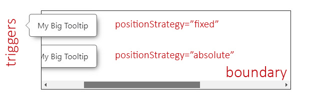

### The Custom Boundary

A custom boundary can be interpreted as a wrapper/container, and the overlay will consider that boundary as the new limits for its positioning.

- **Property:** `boundary`.
- **Type:** `HTMLElement`.
- **Default:** `<body>`.

See [the example](#example).

### The Safe Space

To establish an extra safe space to the viewport's edges in case some fixed areas are present, such as headers, side menus or footers.

This way, the overlay will consider this area as the _edge limit_ and reposition itself if reached. Most useful use cases are related to scroll events.

- **Property:** `safeSpace`.
- **Type:** `OverlayBaseSafeSpace`:
  - `object` with each side as a property of type `number`.
- **Default:** `{ top: 0, bottom: 0, left: 0, right: 0 }`.

#### The Safe Space Off

In this scenario we can see two different overlays with the default position/alignment (`top-center`) when the safe space is not set at all.

Both overlays have enough space at the top and can be centered.

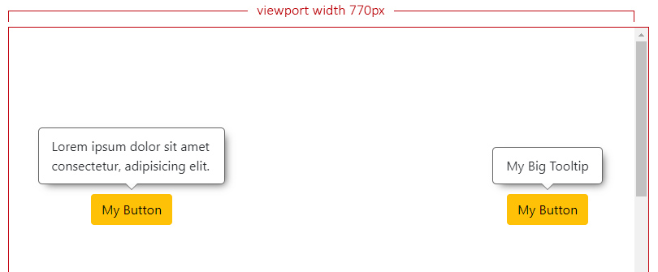

#### The Safe Space On

Let's say we have a header at the top (`65px`) and a left side menu (`50px`), both fixed to the page.

Now we set the safe space with the desired values for our fixed landmarks:

```typescript
this.setBaseConfig({
    safeSpace: { top: 65, left: 50 },
    ...
}),
```

> **NOTE:** For the next examples, we have forced the right overlay to ignore the safe space.

The overlay at the left doesn't have enough space to be centered anymore and it will analyze where can be aligned, which will result at `start`.

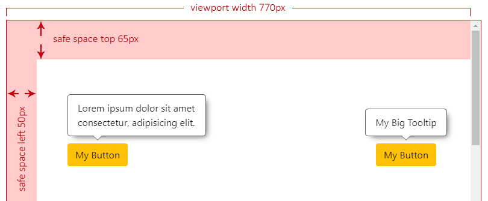

Now we start scrolling down and, the moment the left overlay reaches the top safe space limit, it will need to check the best side to reposition itself, which will result at `bottom`.

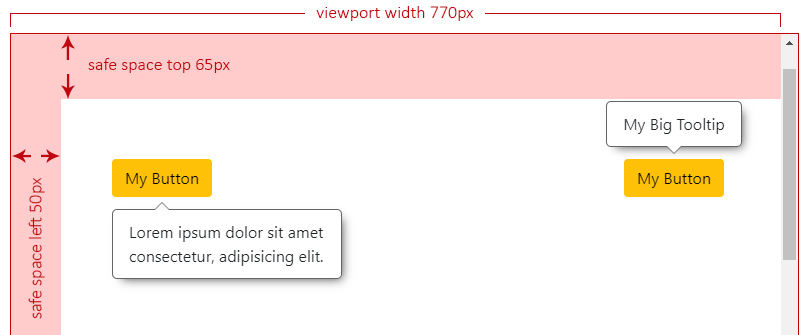

We keep scrolling down and we can see the right overlay not repositioning and overlapping the header. This can be **an issue** depending on what `z-index` your landmarks are set.

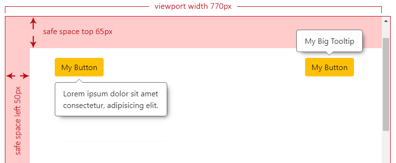

### The Offset Size

It defines the space between the overlay and its trigger.

- **Property:** `offsetSize`.
- **Type:** `number`.
- **Default:** `5`.
- **Accepts:** positives and negatives.
- **Translated to:** _pixels_.

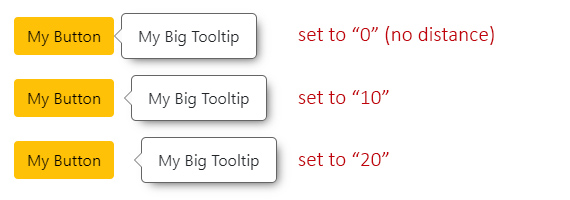

### The Fluid Alignment

To establish whether the overlay's alignment will stick to the edges of the viewport/boundary (if set to `true`) or make jumps between `start`, `center` or `end` (if set to `false`).

- **Property:** `fluidAlignment`.
- **Type:** `boolean`.
- **Default:** `false`.

#### The Fluid Alignment On or Off

If `fluidAlignment` is on, and the overlay width (or height) exceeds both, the trigger's size and the free space to be centered, it will stick to the closest viewport/boundary edge. If not (is off), it will use one of the edges of the trigger to align itself (`start` or `end`).

In the next example, both overlays can't be centered and they have to decide where to be aligned. The one on the left is the only one that has `fluidAlignment` set to `true`, which means that it's going to be aligned to the left side of the viewport, while the one on the right should respect either `start`, `center` or `end` (in this case) of its trigger.

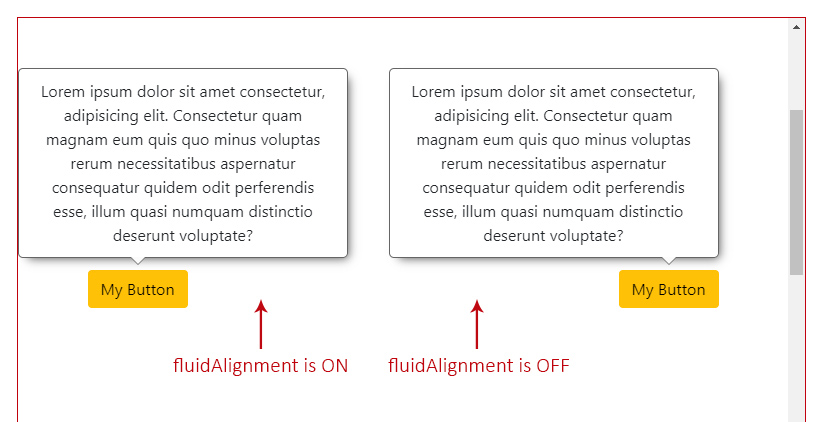

When this option is on, and the overlay is sticked to one of the viewport's sides (the left one in this case), as shown in the example above, you can access the property `overlayOutside` with the side that it is _out_, as its value (`'left'`).

### The Fluid Size

To establish whether the overlay size should adjust to the free space (if set to `true`) or stay as its original size, with the possibility of being out of the visible area, if larger (if set to `false`).

- **Property:** `fluidSize`.
- **Type:** `boolean`.
- **Default:** `true`.

The size adjustment will depend of the overlay's position:

- if `top` or `bottom`, the `height` of the overlay will be adjusted to the free space of any of those sides.
- if `left` or `right`, the `width` of the overlay will be adjusted to the free space of any of those sides.

#### The Fluid Size On or Off

If `fluidSize` is on, and the overlay is bigger than the chosen side free space, it will return the max `width` or `height` within `maxSize` (as part of [the Calculated Position](#the-calculated-position)).

At this point, is up to you to force either the `width` or `height` of your overlay to those "max" values, and handle any possible overflow inside of it.

If is off, `maxSize` will return `null` for both, `width` and `height`.

Check also [the square areas](#the-overlay-reposition-by-square-areas) to better understand how the free space is calculated in case the overlay size exceeds it.

### The Viewport Size

The viewport size (without the scrollbars into consideration).

- **Type:** `ViewportSize`:
  - `object` with `width` and `height` as a property of type `number`.
- **Default:** viewport's width and height.

### The Viewport Safe Size

The viewport safe size is the result of how many free space (`width` and `height`) the overlay can consider to be positioned.

It will be the calculation between the [viewport size](#the-viewport-size), a given [custom boundary](#the-custom-boundary) (also without the scrollbars into consideration, if any) and/or the [safe space](#the-safe-space).

- **Type:** `ViewportSize`.

In the following two examples, the green area is the so called _viewport **safe** size_, meaning that the overlay will consider only that area to establish its position and alignment.

#### The Viewport Safe Size Without a Boundary

Imagine having a viewport of `755px` of width and `415px` of height and two safe spaces, one at the `top` of `65px` and another at the `left` of `50px`.

In this case, the _safe size_ will be the result of:

- the viewport's `width` minus the `left` safe space: `755 - 50 = 705px`.
- the viewport's `height` minus the `top` safe space `415 - 65 = 350px`.

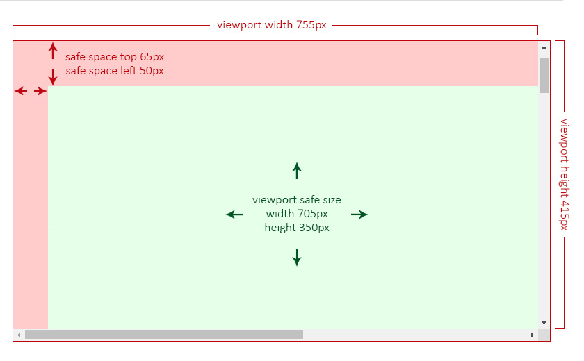

#### The Viewport Safe Size With a Boundary

Now imagine having the same viewport (`755px` by `415px`), the same safe spaces (`65px` and `50px`) and a [custom boundary](#the-custom-boundary) of `730px` of `width` and `240px` of `height`. This boundary is, in this examnple, by design, partially behind the left safe space.

Now, the _safe size_ will be the result of the custom boundary size minus the safe space area that is overlapping at its left side.

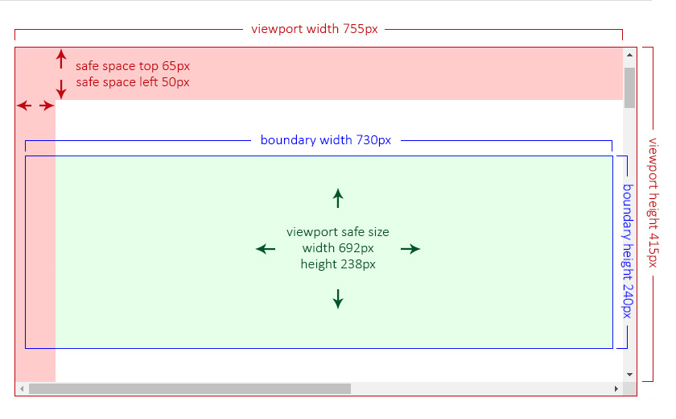

## The Types

### The Overlay Position

Means the relative position to the trigger.

- **Type:** `OverlayBasePosition`.
- **From the `enum`:** `POSITION`.
- **Default:** `'top'`.
- **Values:**
  - `'top'`.
  - `'bottom'`.
  - `'left'`.
  - `'right'`.

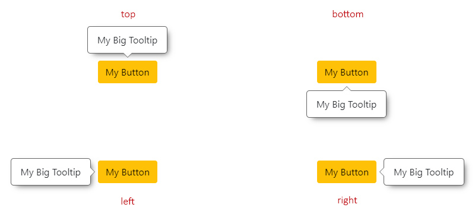

#### The Overlay Reposition

The repositioning will depend on the chosen `position`.

For instance, if the overlay position is set to `'top'`, it will check if there is enough space to be placed there. If not, it will try at `'bottom'`, then at `'left'` and finally at `'right'`.

The order would be:

- `'top'` -> `'bottom'` -> `'left'` -> `'right'`.
- `'bottom'` -> `'top'` -> `'left'` -> `'right'`.
- `'left'` -> `'right'` -> `'top'` -> `'bottom'`.
- `'right'` -> `'left'` -> `'top'` -> `'bottom'`.

> **NOTE:** If, at any point, the overlay (especially when `resize` event occurs on the page) doesn't have enough space at any of the allowed sides to fit its maximum size, it will choose the one with [more square area](#the-overlay-reposition-by-square-areas).
>
> Check also [the `fluidSize` On or Off](#the-fluid-size-on-or-off).

##### The Overlay Reposition by Square Areas

In the next scenario, the overlay has a `top` position with `positionsAllowed` set to `'opposite'`, which means that only `top` or `bottom` are allowed.

Given the current overlay's maximum size is set to `300px` by `262px`, its height exceeds both allowed sides (`205px` at top and `147px` at bottom), so the overlay will choose the one with more available square area:

- top: `770 x 205 = 157850` ✔️.
- bottom: `770 x 147 = 113190` ❌.

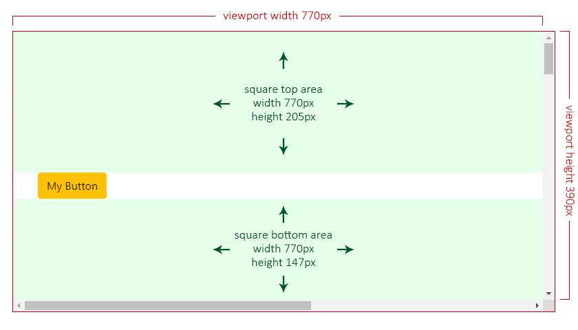
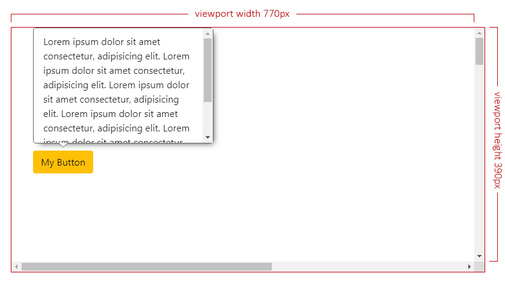

### The Overlay Alignment

Means the relative alignment to the trigger.

- **Type:** `OverlayBaseAlignment`.
- **From the `enum`:** `ALIGNMENT`.
- **Default:** `'center'` (or `'start'` if `alignmentsAllowed` is set to `'edges'`).
- **Values:**
  - `'start'`.
  - `'center'`.
  - `'end'`.

#### The Overlay Alignment Horizontally

This applies for `top` and `bottom` positions.

- `start`: means aligned to the left side of the trigger.
- `center`: means aligned to the center of the trigger.
- `end`: means aligned to the right side of the trigger.

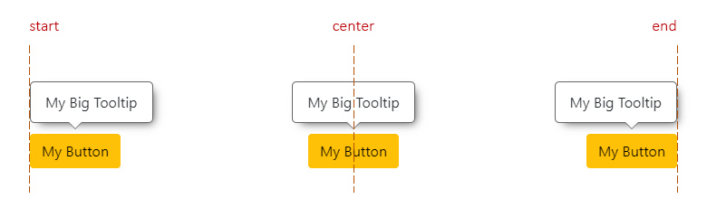

#### The Overlay Alignment Vertically

This applies for `left` and `right` positions.

- `start`: means aligned to the top side of the trigger.
- `center`: means aligned to the center of the trigger.
- `end`: means aligned to the bottom side of the trigger.

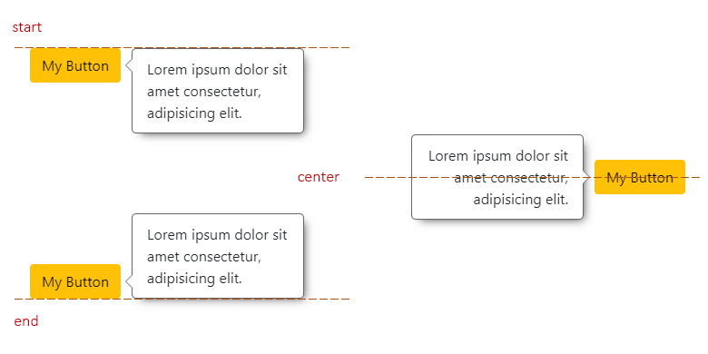

#### The Overlay Realignment

The realignment will depend on the chosen `alignment`.

For instance, if the overlay alignment is set to `'center'`, it will check if there is enough space to be placed there. If not, it will try at `'start'` and finally at `'end'`.

Now, if `alignmentsAllowed` is set to `'edges'`, checking for `'center'` alignment will be completelly ignored, checking first at `'start'` and finally at `'end'`.

## The Overlay Base Class

This is an abstract class, which is the base of all the main calculations for the overlay to be positioned in the most adequate space.

You can create your own components and/or directives and extend them from this class.

```typescript
import { OverlayBase } from '@a11y-ngx/overlay-base';

@Directive({ ... })
export class MyCustomOverlay extends OverlayBase {
    constructor(private hostElement: ElementRef) {
        super();
    }
    /* Implement your own logic... */
}
```

### The `setBaseConfig()` Method

To set the main config, it accepts a single parameter `customConfig` of type [`OverlayBaseConfig`](#the-configuration-object).

### The `attachOverlay()` Method

To establish the overlay `HTMLElement` to base all calculations on, start the listeners and receive the final position and alignment for rendering (along with the `maxSize`).

If a custom boundary was set in the config, a `scroll` event will be additionally attached to it.

Accepts two parameters:

- `overlayElement` of type `HTMLElement`.
- `debounceTimeMs` (_optional_) of type `number` (set to `10` by default).

Returns an `Observable` of type [`OverlayBaseCalculatedPosition`](#the-calculated-position) which will be returning data every time [the listeners](#the-listeners) are triggered.

#### The Calculated Position

- **Type:** `OverlayBaseCalculatedPosition`.
- **Properties:**

  | Property | Type | Description |
  |:---------|:-----|:------------|
  | `position` | [`OverlayBasePosition`](#the-overlay-position) | The final position for the overlay |
  | `alignment` | [`OverlayBaseAlignment`](#the-overlay-alignment) | The final alignment for the overlay |
  | `render` | `OverlayBaseRenderPosition` | The (top, bottom, left or right) coordinates depending on the chosen [Position Strategy](#the-position-strategy) |
  | `maxSize` | `OverlayBaseMaxSize` | The possible max size (`width` or `height`) if [`fluidSize`](#the-fluid-size) is set to `true` |

### The `detachOverlay()` Method

To stop and complete all the listeners (`Subject()` and `BehaviorSubject()`).

This will also complete the `isDetached$` subject, ideally so you can listen and kill your `attachOverlay()` subscription.

### The `updateOverlaySize()` Method

> **IMPORTANT:** The overlay original size is calculated only once, the first time.

Since the overlay content could dynamically change (and so its size), in these cases you can make use of this method, to update the overlay `ClientRect` data and calculations will be more precise for its final position and alignment.

This will trigger [the `recalculate()` method](#the-recalculate-method).

### The `recalculate()` Method

To update on demand and return recalculated position/alignment data.

### The `triggerBoundaryDistance()` Method

Accepts a single parameter `position` of type [`OverlayBasePosition`](#the-overlay-position) and returns a `number` that means the distance (in pixels) between the trigger and the boundary/viewport for that given side.

This will take into consideration a given [Custom Boundary](#the-custom-boundary) and/or [Safe Space](#the-safe-space).

### The public Properties, Getters and Setters

| Name | Type | Of Type | Description |
|:-----|:-----|:--------|:------------|
| `uid` | `property` | `number` | A unique auto-incremented value for each overlay created |
| `getCurrentPosition` | `get` | `OverlayBasePosition` | The position after all calculations. See [the Overlay Position](#the-overlay-position) |
| `getCurrentAlignment` | `get` | `OverlayBaseAlignment` | The alignment after all calculations. See [the Overlay Alignment](#the-overlay-alignment) |
| `isTop` | `get` | `boolean` | The position is `top` |
| `isBottom` | `get` | `boolean` | The position is `bottom` |
| `isLeft` | `get` | `boolean` | The position is `left` |
| `isRight` | `get` | `boolean` | The position is `right` |
| `isTopBottom` | `get` | `boolean` | The position is `top` or `bottom` |
| `isStart` | `get` | `boolean` | The alignment is `start` |
| `isCenter` | `get` | `boolean` | The alignment is `center` |
| `isEnd` | `get` | `boolean` | The alignment is `end` |
| `viewportSize` | `get` | `ViewportSize` | See [the Viewport Size](#the-viewport-size) |
| `viewportSizeSafe` | `get` | `ViewportSize` | See [the Viewport Safe Size](#the-viewport-safe-size) |
| `positionStrategy` | `get`/`set` | `OverlayBasePositionStrategy` | See [the Position Strategy](#the-position-strategy) |
| `safeSpace` | `get`/`set` | `OverlayBaseSafeSpace` | See [the Safe Space](#the-safe-space) |
| `offsetSize` | `get`/`set` | `number` | See [the Offset Size](#the-offset-size) |
| `fluidSize` | `get`/`set` | `boolean` | See [the Fluid Size](#the-fluid-size) |
| `fluidAlignment` | `get`/`set` | `boolean` | See [the Fluid Alignment](#the-fluid-alignment) |
| `triggerElement` | `get`/`set` | `HTMLElement` | See [the Trigger element](#the-trigger-element) |
| `overlayElement` | `get`/`set` | `HTMLElement` | The overlay element |
| `boundaryElement` | `get`/`set` | `HTMLElement` | See [the Custom Boundary](#the-custom-boundary) |
| `overlayOutside` | `property` | `OverlayBasePosition` | Provides the side of the viewport/boundary where the overlay would be out of in case `fluidAlignment` is set to `true`. See [the Fluid Alignment On or Off](#the-fluid-alignment-on-or-off) |
| `maxSize` | `property` | `OverlayBaseMaxSize` | To save the overlay max size and provide a better calculation for the `maxSize` values returned in the [attachOverlay() Method](#the-attachoverlay-method) |
| `isDetached$` | `property` | `Subject<void>` | So you can use it to kill the `attachOverlay()` subscription. See [the example](#example) |

### The Listeners

These are the listeners that will be approperly triggered so the overlay can reposition and/or realign.

| Listener | Default | Description |
|:---------|:--------|:------------|
| Window resize | _Always listening_ | The window changes its size |
| Page scroll | `true` | See [allow scroll listener](#the-page-scroll-listener) |
| Custom Boundary scroll |  _Always listening_ (if any) | See [the Custom Boundary Scroll listener](#the-custom-boundary-scroll-listener) |
| _Force update_ |  _Always listening_ | If the [`recalculate()` method](#the-recalculate-method) is invoked |

#### The Page Scroll Listener

To allow listening for page scrolling.

- **Property:** `allowScrollListener`.
- **Type:** `boolean`.
- **Default:** `true`.

This option can be set to `false` (to avoid extra listeners) in case you are **absolutely sure** the trigger won't change its position, such as within a fixed landmark.

Whenever `allowScrollListener` is set to `true` and there is a [trigger](#the-trigger-element) of type `HTMLElement` present, the listener will execute the repositioning in case the page gets scrolled.

> **IMPORTANT:** If a `DOMRect` is established as the trigger, the page scroll will not be used as a listener.

#### The Custom Boundary Scroll Listener

If a [custom boundary](#the-custom-boundary) was set and, at some point, has overflow and gets scrolled, the listener will be executed to check if the overlay reached any of the boundary limits and will reposition itself, if necessary.

## Example

This is a quick example on how to crate a basic tooltip directive extending the `OverlayBase` class.

**Tooltip Directive:**

```typescript
import { Directive, Input, ElementRef, OnDestroy } from '@angular/core';
import { Subject, merge } from 'rxjs';
import { takeUntil } from 'rxjs/operators';

import { OverlayBase } from '@a11y-ngx/overlay-base';

@Directive({
    selector: '[tooltip]',
    standalone: true,
    host: {
        '(mouseenter)': 'createTooltip()',
        '(mouseleave)': 'destroyTooltip()',
        '[attr.aria-labelledby]': 'tooltipElement ? id : null',
    },
})
export class MyCustomTooltip extends OverlayBase implements OnDestroy {
    @Input() tooltip: string;

    private get id(): string {
        return `my-custom-tooltip-${this.uid}`;
    }

    private readonly destroy$: Subject<void> = new Subject<void>();

    private tooltipElement: HTMLDivElement | undefined = undefined;

    constructor(private hostElement: ElementRef) {
        super();

        // 1. We set the basic config needed for our tooltip
        this.setBaseConfig({
            // Trigger: mandatory, it is where the overlay will calculate its position from
            trigger: this.hostElement.nativeElement,
            // Position: We want it to open at bottom
            position: 'bottom',
            // Offset: We want a 10px distance between trigger & overlay
            offsetSize: 10,
            // Boundary: We want the <main> element as the boundary
            boundary: document.querySelector('main'),
        });
    }

    ngOnDestroy(): void {
        this.destroy$.next();
        this.destroy$.complete();
        this.destroyTooltip();
    }

    // 2. We create the tooltip on (mouseenter) event
    private createTooltip(): void {
        // We create a new <div> element and set the id and inner text
        this.tooltipElement = document.createElement('div');
        this.tooltipElement.id = this.id;
        this.tooltipElement.innerText = this.tooltip;

        // We use 'opacity' instead of 'display' so the Base class
        // can check the dimensions for a proper positioning
        this.tooltipElement.style.opacity = '0';
        // 'positionStrategy' is already set to 'fixed' by default
        this.tooltipElement.style.position = this.positionStrategy;
        // We set some other basic styles
        this.tooltipElement.style.border = '1px solid #0c0b46';
        this.tooltipElement.style.backgroundColor = '#bab6ff';
        this.tooltipElement.style.color = '#0c0b46';
        this.tooltipElement.style.padding = '5px 10px';
        this.tooltipElement.style.borderRadius = '5px';

        // We append it to the body
        document.body.appendChild(this.tooltipElement);

        // We tell the Base class to attach the overlay and
        // we will subscribe to handle set the position
        this.attachOverlay(this.tooltipElement)
            // We kill the subscription when the overlay is detached
            // or this directive gets destroyed
            .pipe(takeUntil(merge(this.destroy$, this.isDetached$)))
            .subscribe(({ render: { top, bottom, left, right } }) => {
                this.tooltipElement.style.top = top !== null ? `${top}px` : null;
                this.tooltipElement.style.bottom = bottom !== null ? `${bottom}px` : null;
                this.tooltipElement.style.left = left !== null ? `${left}px` : null;
                this.tooltipElement.style.right = right !== null ? `${right}px` : null;

                // We make the overlay fully visible now
                this.tooltipElement.style.opacity = '1';
            });
    }

    // 3. We destroy the tooltip on (mouseleave) event
    private destroyTooltip(): void {
        this.detachOverlay();
        this.tooltipElement.remove();
        this.tooltipElement = undefined;
    }
}
```

**On your component:**

Add `MyCustomTooltip` to your component or module `import` array, and add it to a `button`.

```html
<button type="button" class="btn btn-dark" tooltip="Something beautiful">
    <i class="fa-solid fa-circle-question"></i>
</button>
```

**Result:**

The tooltip will open with position 'bottom' (as it was defined in the config) and alignment 'start' because it's respecting the boundary limit.

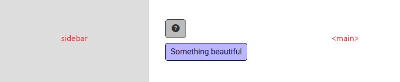

If we had chosen not to set the boundary, the tooltip alignment would have been centered by default.

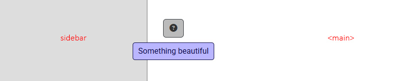
